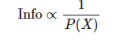

## 컴퓨터 시스템 기본

### 운영 체제의 목표
- 기능: 페인 포인트에 대해서 해결해주는 것
- 컴퓨터 시스템 : 기능들을 처리해주는 부품 (정보를 processing하는 것,)
- 운영체제: 컴퓨터 시스템을 잘 사용(운영 및 관리)할 수 있도록 도와주는 것

### 운영 체제 정의

### Information란?
- DIKW에서 3번째에 들어가는 것.
- 

#### 정보량(Ref. PDF)
- 정보: 확률의 기대값에 대해서  
- 확률과 정보는 반비례
- Hartley의 정보량

- 통계적 정보량

#### 엔트로피
- 통계학에서 평균 정보량

### 컴퓨터 시스템 구조
- 4가지 구성 요소: 하드웨어, CPU, 메모리, I/O 장치

### 컴퓨터 구성 요소의 추상
- 추상화: 개념화

### 컴퓨터 시스템 구성
- 폰노이만 architecture: 메모리에 모든 것들이 시스템 버스로 연결되어 있는 구조

### Interrupt Handling
- CPU의 구성 요성: 레지스터, 프로그램 카운터 

### 최신 컴퓨터의 작동 방식

### 더즁 프로그래밍 시스템을 위한 메모리 레이아웃
- 한 프로세스에 대해서 메모리 구조가 형성되어질 때, 5개의 계층으로 이루어짐
  - 하나의 테스크를 프로세스
  - 하나를 선점을 해서 침해받지 않도록 하는 것
  - 구성요소
    - 5계층: 구문: 제일 아래에 들어감 (if-else, for문 등)
    - 4계층: 초기화 되는 변수들
    - 3계층: 초기화 되어 있지 않는 변수들
    - 2계층: heap공간: user defined 변수들. garbage 생성될 수가 있어서 null 혹은 0으로 초기화 필요 (메모리 누수가 발생할 수도 있음)
    - 1계층: static, final 변수들

### 듀얼 모드 작동
- 운영 체제는 커널 모드 말고도 사용자 모드로 이루어지는데 사용자모드 = 듀얼 모드
- 커널 모드가 필요할 때 사용자 모드에서 호출을 하면서 사용이됨.

### 사용자에서 커널 모드로 전환
- 사용자 모드에서 인터럽트가 필요한 상황이 존재
1. user 모드에서 시스템 콜
2. 커널 모드에서 CPU가 해당 처리
3. user 모드에서 system 콜 리턴

### Timer
- 프로세스를 독차지 하는 것을 방지하기 위해
- 

#### +++
- 브라우저: 운영 체제가 아닌 프로그램으로 엔진(HTML을 해석)
- 안드로이드: 운영체제 
- 운영체제의 커서: 단일 캐릭터를 받음
- 비동기화 vs 멀티테스킹
  - 동기화는 트랜젝션이 일어날 때 락이 걸리는데 비동기화는 트랜젝션과 무관한 작업을 할 떄 사용하는데 이때 락이 일어나지 않음.
  - 멀티테스킹의 기술 중 하나로 비동기호와 동기화