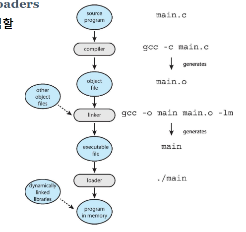

## 운영체제 개관

### 운영체제 서비스 보기
- 운영체제 서비스를 system calls를 이용해서 사용

### Command Line interpreter

### System Cals
- Copy/Paste: Reuse하는 방법 중 하나
- API: Application 사용하기 위해서 사용하는 libray

### 시스템 호출 매개변수 전달
1. 레지스터에 매개변수 전달
2. (제일 많이 사용) 레지스터에서 매개변수로 전달된 블록의 주소
3. 스택에 배치되거나 푸시되고 운영 체제애 의해 스택에서 꺼지는 매개 변수

### System Services?
- 백그라운드 서비스
  - 데몬
- 응용 서비스

### Linker and Loaders
- 프로세스를 생성하는데 있어서 가장 기본이 되는 내용
- C
  - linker를 생성하는 옵션이 `-o` -> 실행가능한 파일이 생성됨.
  - loader: 하드 디스크에 있는 것을 메모리에 옮김 (<-> store: 하드 디스크에 적재)
    - process 5계층이 CPU에 올라가게 됨.

  - entry 함수 이름은 항상 main.c 
  

    - entry가 아닌 것을 java에서는 beans 다른 곳에서는 package, modules

### gcc의 사용 gcc의 사용(Ref. Pre-Requisites.pdf)
- compile: 목적 파일을 만드는 과정 (번역 과정)

### make
#### make의 개요
- 소스코드 생성 후, 명세 작업을 진행 (모든 것을 일괄적으로 진행시키기 위해)
  - `$()`: 치환 변수

### Applications
#### 응용 프로그램이 운영 체제에 특정한 이유

### Oerating System Structure
- Hybrid Systems
