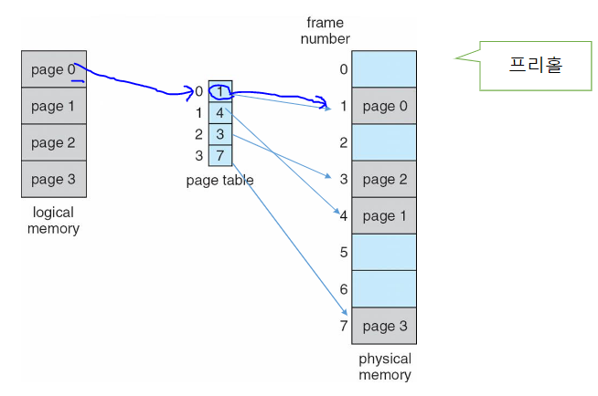

## Main Memory
**논리적 대 물리적 주소 공간**
- 물리 공간: 메모리 주소에서 볼 수 있는 공간

**메모리 관리 장치(MMU)**
- logical address가 MMU에서 매칭을 해주 것을 가지고 physical address를 구해서 메모리를 찾는다

### Contiguous Memory Allocation
#### 연속 할당
- 초기에 할당하던 방식 중 하나
- 가장 초기에 사용한 방식: 같은 크기로 메모리를 할당하는 것
- 파티션 분할
- 재배치 레지스터 활용하게 디면 프로세스가 사용되어 지고 있는 상태에서 코드 및 데이터 변경이 일어날 때 보호 가능
  - > 제한 된 범위 내에서 사용할 수 있도록 도와주기 때문에

#### 가변 파티션
- 효율성을 고려한 상태에서 가변한 사이즈를 할당
**다중 파티션 할당**
- 파티션 수를 무조건 적으로 많이 하는 것이 좋지 않음
- Hole: 비어있는 파티션 (== free partition)
  - 비어있는 파티션을 찾아 프로세스를 올려주는 것이 가장 중요

#### 단편화 Fragmentation
- 외부 단편화
- 내부 단편화: 사용되지 않음
**압축으로 외부 조각화 감소**
- 압축을 진행하다보면 I/O 발생 가능성 존재
- 백업 저장소에도 또한, 동일한 조각화 문제 존재

### Paging
- Page: 논리적인 메인 메모리를 동일한 크기로 나눠준 것
  - 해당 Page를 Frame에 사용
  - 논리적인 주소를 물리적인 주소로 변경해주는 것이 필요 (페이지 테이블 사용)
  
#### 주소 변환 체계
- 2의 거듭제곱으로 크기를 나타내줌

#### Pagin Hardware
- p: 논리적인 주소
- f: 해당 정보를 가지고 p의 논리적이 주소중 d만 가지고 물리적인 주소를 구함
**논리적 및 물리적 메모리의 페이징 모델**

### Structure of the Page Table
- 두 개의 정보를 메모리에 저장
  - PTBR: 
  - PTLR:

#### TLB(Translation Look-Aside Buffer) (번역 참조 버퍼)
**TLB를 사용한 페이징 하드웨어**
- TLB로 들어오면 p가 위치에 매핑된 값과 page table의 f와 물리적인 주소 반환
  - 주소가 하나가 만들어지는 것을 hit
  - page table까지가 miss

**유효 액세스 시간**
EAT = 적중율 * 액세스 타임 + (1-적중률) * 액세스 타임 * 2
- 필요 정보: 적중율, 액세스 타임

#### 페이지 테이블의 구조
**Hashed Page Tables**
- page table: hash function에 대한 hash table 사용

**Inverted Page TablePage Tables**
- 정방향: 각 프로세스가 페이지 테이블을 갖고 가능한 모든 논리적 페이지를 추적하는 대신 모든 물리적 페이지 추적
- 공유된 물리적 주소를 가지고 가상 주소를 매핑해나가는 것
- page table: 물리적인 주소에 대한 인덱스를 사용

### Swapping
- CPU에 올릴 프로세스나 메모리가 없으면 프로세스 교환이 필요하여 컨텍스트 전환 시간이 길어질 수 있음
#### 모바일 시스템에서 스와핑
- 

#### ++
- 루틴: 하나의 작은 처리 로직