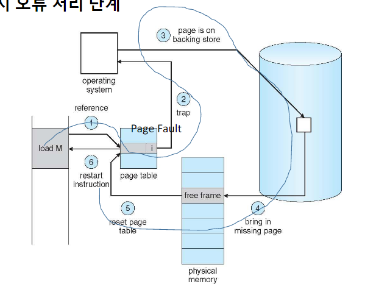

## Virtual Memory
**물리적 메모리보다 큰 가상 메모리**
- 물리적인 메모리에 비해서 가상 메모리가 훨씬 큰 경우가 존재

**Virtual-address Space**
- Max에 보통 OS와 같은 정보들이 올라감
- stack과 heap 사이에 각 쌓이는 데이터가 많아질 수록 늘어남
- hole: 쓰여지지 않는 공간

### Demand Paging
- load하는 시간 혹은 필요할 때 메모리를 가져옴
- 필요할 때만 페이지를 메모리로 가져옴
- MMU: 메모리 관리 장치
- 상주한 경우 (= 수요되고 있는 경우)
  - 비수요 페이지와 차이 없음 -> 이미 사용중이기 때문에
- 유효하지 않은 경우 page fault를 발생시킴
- 
**일부 페이지가 메인 메모리에 없을 때의 페이지 테이블**
- G의 경우 어디로 가야할 지 physical memory 매핑이 되어있지 않음 -> Page Fault 발생

**페이지 오류 처리 단계**
- 자유 프레임 찾기
  - Page Fault 발생 -> Fault 되어진 것을 메모리에 load하기 위해 비어있는 메모리 찾아서 올려주는 방식
- 페이지 교체를 통해서 Fault를 처리하는 경우, 페이지 교체 알고리즘이 필요
- Flow 설명

  

    - page fault로 trap을 발생 시킴

## Page Replacement
### 기본 페이지 교체
- 보통 vicitim frame을 선택하여 교체
- Flow 설명

    

#### 페이지 및 프레임 교체 알고리즘
- 알고리즘 평가: Page Fault 수를 계산
- 메모리 분할의 크기가 작을 수록 Page Fault 수가 많아짐

#### First-In-First-Out(FIFO) Algorithm
- 0이 들어왔을 때는 교체를 하지 않음.
- Frame이 많아질수록 Page 오류가 생기는 경우 존재 (Belady의 이상 현상을 보여주는 FIFO)

#### 최적 알고리즘 OPT
#### Least Recently Used (LRU) Algorithm
#### Second-chance Algorithm
#### Countung Algorithms
- Count: 빈도 수
- LFU(Lease Frequently Used): 빈도가 적은 것
- MFU(Most Frequently Used)
#### Page-Buffering Algorithms
- 필요할 때마다 Pool에 victim 추가
- 해당 알고리즘을 위해서는 victim을 선택하는 것이 중요

### Allocation of Frames
#### 고정 할당
- 균등 할당
- 비례 할당
  - 프로세스 규모에 따라서 할당

### Thrashing
#### 페이징 및 스레싱 요구
- 프로세스가 특정한 지역에서 많이 처리가 되는 것
#### Page-Fault Frequency
**WSS보다 직접적인 접근 방식**
- PFF: 빈도에 대한 빈도 설정하고 로컬 교체 정책을 사용해서 처리
  - fault가 너무 높으면 upper bound에 맞춰지도록 함
  - fault가 너무 낮으면 lower bound에 맞춰지도록 함

#### 작업 집합 및 페이지 오류율
- 시간에 따라서 페이지 오류율이 굉장히 높아지는 타이밍이 존재 -> 이때 working set을 변경 

### Allocating Kernel Memory
#### Buddy System
#### Slab Allocator
- 슬랩
  - Ex) Cache
- 페이지: 물리적인 주소의 프레임 블록
**Slab Allocation**
- 상태 
  - Full
  - Empty
  - Partial