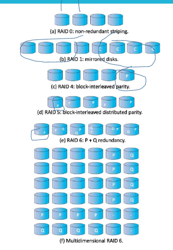

## Mass-Storage Systems

### 대용량 저장소 구조 개요
- 하드디스크의 성능 측정: 회전 수
- 포지셔닝 시간 + 탐색 시간 : 액세스 시간

#### 휘발성 메모리 (Volatile Memory)

#### Disk Structure
#### Disk Attachment
- SCSI: 프린트할 때 병렬로 되어진 것, MAC에서 외장장치의 케이블
- 컨트롤러(HBA): 버스의 데이터 전송을 수행

### Scheduling
#### HDD Scheduling
- 대역폭: (서비스의 첫 번째 요청 ~ 마지막 전송 완료 사이의 총 시간) / 총 바이트 수

#### Disk Scheduling
- 디스크 I/O 요청 소스
  - 운영체제
  - 시스템 프로세스
  - 사용자 프로세스
- 사용량이 많으면 Queue(대기열)에서 대기
- 헤드 포인터: 처음에 시작하는 포인터
**FCFS**
**SCAN**
- 스캔닝을 하는 것처럼 한쪽 끝에서 이동해서 동작
  - 무조건 0으로 가는 것이 아닌 가는 과정에서 존재하면 찾으면서 가는 알고리즘
**C-SCAN**

#### NVM Scheduling

### Error Detection and Correction
- 패리티 비트: 체크를 하기 위해 사용
  - 네트워크를 전송할 때 데이터를 정상적으로 전달했는지 확인하기 위해 보통 많이 사용
- ECC: 감지를 하는 것 뿐만아니라 정정까지 해주는 것

### Storage Device Management
- 디스크를 사용하기 위해 OS를 자체 데이터 구조를 디스크에 기록해야하기 때문에 디스크 분할을 위한 Partition 방식을 사용

#### Boot block
- root partition
  - OS 포함하고 있기 때문에 깨지면 시스템이 켜지지 않음
- MBR: boot block을 관리하기 위해 사용
  - 부트 스트랩: MBR에 저장
    - ROM에는 위치만 저장 

### Swap-Space Management
### Storage Attachment
**스토리지 첨부 파일**
**네트워크 연결 스토리지**
- NAS: master node 1대, data node 2대로 구성
**Cloud Storage**
**Storage Area Network**
- SAN
  - 네트워크로 구성되어서 토폴로지가 필요

### RAID Structure
- 스트라이핑: 여러 개를 가지고 하나처럼 쓸 수 있도록 하는 것
- Block interleaved parity: 11번째에 패리티에 대한 블록게 대한 디스크를 이용
  - 6: 패리티를 하나만 쓰는게 아니라 서로 다른 패리티 2개(P 패리티, Q 패리티)를 사용
- 구성을 다양하게 가능
**RAID Levels**

  

  - non-redundant striping: 하나도 중복되지 않고 나열되어 있는 것
  
#### ++
- OS에서 RR & priority 스케줄링 사용
- paging에서는 LRU 사용
- 디스크 C-scan, FCFS

